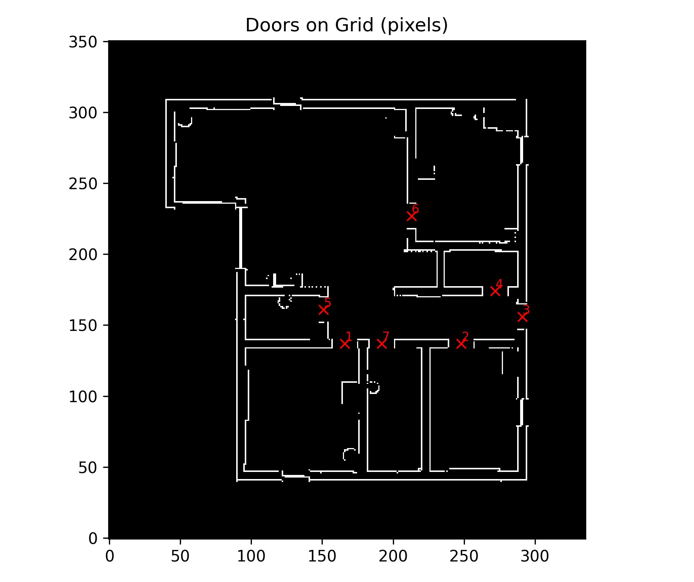
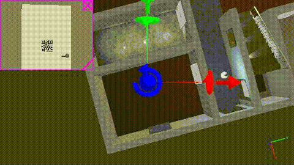

# TurtleBot Webots Simulation for Environment Mapping, Localization, and Navigation with Door Detection

## Overview

This project presents a robotic simulation framework developed in Webots, focusing on autonomous navigation, localization, and environment understanding with a TurtleBot-like robot. The objective of the study is to demonstrate how mobile robots can be deployed in structured environments to detect architectural features, such as doors, while performing mapping and navigation tasks.  

The simulation integrates a custom world (`final.wbt`) and a Python-based controller (`turtle_controller.py`). The controller governs the robot’s movements, sensor data acquisition, and environment interaction. The framework incorporates **mapping, localization, and navigation** techniques:  

- **Mapping** is achieved through occupancy grids and metric map generation.  
- **Localization** is performed using **particle filtering**, which allows the robot to estimate its pose in the environment despite sensor noise.  
- **Navigation** is guided by the **A-star search algorithm**, enabling the robot to compute collision-free paths to target destinations.  

Importantly, this work **does not use GPS or compass sensors**. Localization is achieved entirely through odometry and range sensor data.  

This repository provides both the simulation world and the analysis scripts required to reproduce the experiments. Results are presented through occupancy maps, door localization figures, and a simulation demonstration video.  

---

## Methodology

1. **Simulation Environment**  
   - A custom environment was developed in Webots, consisting of multiple rooms connected through doors.  
   - The robot is equipped with range sensors and odometry for spatial perception.  
   - GPS and compass sensors are intentionally excluded, so localization depends only on probabilistic filtering.  

2. **Controller Implementation**  
   - The Python controller governs the motion of the robot and interfaces with the Webots API.  
   - Sensor data is used for both environment mapping and localization.  
   - Doors are detected by analyzing discontinuities in the occupancy grid.

3. **Mapping and Data Representation**  
   - The environment is represented in two ways:  
     - **Pixel-based occupancy grid**, which discretizes space into a 2D grid.  
     - **Metric map in meters**, which translates pixel values into real-world coordinates.  

4. **Localization**  
   - A **particle filter** is employed to estimate the robot’s position and orientation.  
   - The filter maintains a set of weighted hypotheses (particles) and updates them with each motion and sensor reading, converging to the most probable pose.  

5. **Navigation**  
   - Path planning is implemented using the **A\*** algorithm.  
   - A\* computes the shortest collision-free path on the occupancy grid, taking into account detected obstacles and structural features.  
   - The planned trajectory is followed by the robot using velocity commands.  

6. **Visualization and Results**  
   - Detected doors are annotated on both pixel-based and metric maps.  
   - The robot successfully navigates between rooms by combining localization and planning.  

---

## Results

The following figures demonstrate the detected door positions. For clarity, the figures are scaled down:

- **Doors on Grid (pixels):**  
  

- **Doors on Map (meters):**  
  

A full simulation run has also been recorded and converted to an animated GIF for demonstration purposes.  
In this run, the **navigation goal is Door1**, and as shown in the map, the robot successfully reaches the position directly in front of the door:

- **Simulation Demonstration:**  
  

---

## Requirements

- Webots R2023 or later  
- Python 3.8 or higher  
- Webots Python API (installed with Webots)  
