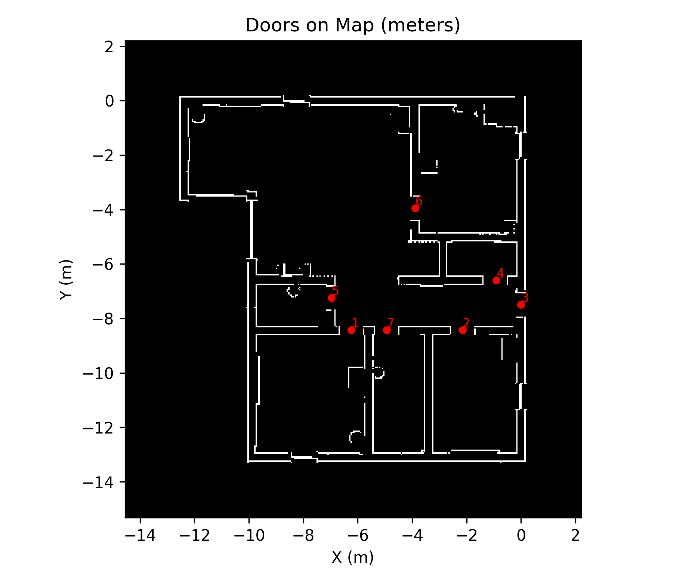

# TurtleBot Webots Simulation for Environment Mapping and Door Detection

## Overview

This project presents a robotic simulation framework developed in Webots, focusing on autonomous navigation and environment understanding with a TurtleBot-like robot. The objective of the study is to demonstrate how mobile robots can be deployed in structured environments to detect architectural features, such as doors, while performing mapping tasks.  

The simulation integrates a custom world (`final.wbt`) and a Python-based controller (`turtle_controller.py`). The controller governs the robot’s movements, sensor data acquisition, and environment interaction. Furthermore, the project evaluates the detection of doors both in pixel coordinates (on an occupancy grid) and metric coordinates (in meters), aligning with robotics practices in simultaneous localization and mapping (SLAM).  

This repository provides both the simulation world and the analysis scripts required to reproduce the experiments. Results are presented through occupancy maps, door localization figures, and a simulation demonstration video.  

---

## Methodology

1. **Simulation Environment**  
   - A custom environment was developed in Webots, consisting of multiple rooms and connecting doors.  
   - The robot is equipped with range sensors that facilitate mapping and feature extraction.

2. **Controller Implementation**  
   - The Python controller handles robot movement and environment sensing.  
   - Data from the simulation is processed to identify structural features (doors) within the map.

3. **Data Representation**  
   - Two representations of the environment are produced:  
     - Pixel-based occupancy grid (resolution-dependent).  
     - Metric map in meters (scale-calibrated).  

4. **Visualization and Results**  
   - Detected door positions are plotted on both representations.  
   - Figures illustrate the accuracy of detection and mapping consistency.

---

## Results

The following figures demonstrate the detected door positions:

- **Doors on Grid (pixels):**  
  

- **Doors on Map (meters):**  
  

A full simulation run has also been recorded and converted to an animated GIF for demonstration purposes:

- **Simulation Demonstration:**  
  

---

## Requirements

- Webots R2023 or later  
- Python 3.8 or higher  
- Webots Python API (installed with Webots)  
- Python dependencies:
  ```bash
  pip install numpy matplotlib
